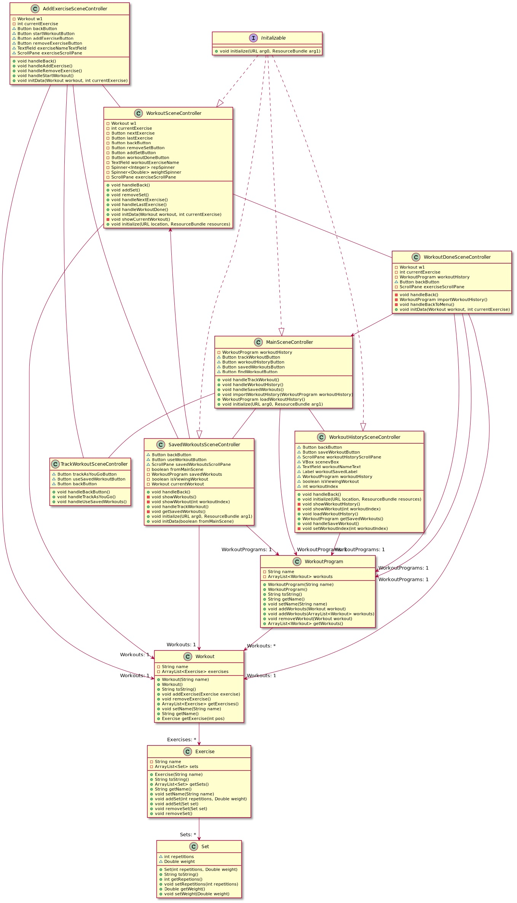

[](https://gitpod.idi.ntnu.no/#https://gitlab.stud.idi.ntnu.no/it1901/groups-2020/gr2068/gr2068/) 


# Group gr2068 repository

Dette er repoet til Gruppe gr2068. Prosjektet i "treningsapp" er vår app som kan være til hjelp med å holde oversikt over egne treningsøkter.

# Kommandoer for å kjøre appen

Starte server: 
- mvn -pl integrationtests jetty:run -D"jetty.port=8999"
- Skriv "/workoutProgram" bak linken i nettleseren for å se JSON

Starte appen:
- Lag ny terminal
- cd treningsapp
- mvn -Premoteapp -pl fxui javafx:run

## Group gr2068 wiki
1. [**Home**](https://gitlab.stud.idi.ntnu.no/it1901/groups-2020/gr2068/gr2068/-/wikis/home)
2. [**Brukerhistorie 1**](https://gitlab.stud.idi.ntnu.no/it1901/groups-2020/gr2068/gr2068/-/wikis/Brukerhistorie-1)
3. [**Brukerhistorie 2**](https://gitlab.stud.idi.ntnu.no/it1901/groups-2020/gr2068/gr2068/-/wikis/Brukerhistorie-2)
4. [**Brukerhistorie 3**](https://gitlab.stud.idi.ntnu.no/it1901/groups-2020/gr2068/gr2068/-/wikis/Brukerhistorie-3)


## Diverse diagrammer

Sekvensdiagram som viser hvordan systemet fungerer ved et viktig brukstilfelle:

```plantuml
participant Bruker
participant Klient
participant RESTServer

Bruker -> Klient: Click: Track as you go 
Klient --> Bruker: AddExerciseScene
Bruker -> Klient: Click: Add Exercise
Klient -> RESTServer: PUT(info)
RESTServer --> Klient: 202 Accepted
Klient --> Bruker: WorkoutList.add
Bruker -> Klient: Click: Workouthistory
Klient -> RESTServer: GET(program)
RESTServer --> Klient: [All workouts] 200
Klient --> Bruker: WorkoutHistoryScene
Bruker -> Klient: Click: workout
Klient -> RESTServer: GET(index)
RESTServer --> Klient: Workout(index) 200
Klient --> Bruker: Workout(index)
```

Diagram over arkitekturen:

```plantuml
package treningsapp <<folder>>{
package config/checkstyle <<folder>> {
}
package libs <<folder>> {
}
package core <<folder>> {
package src <<folder>> {
package main/java/treningsapp <<folder>> {
package core. <<folder>> {
}
package json. <<folder>> {
}
}
package test/java/treningsapp <<folder>>{
package .core <<folder>> {
}
package .json <<folder>> {
}
}
}
}
package fxui <<folder>> {
package src. <<folder>> {
package main <<folder>> {
package java/treningsapp/ui <<folder>> {
}
package resources <<folder>> {
package savefiles <<folder>> {
}
package treningsapp/ui <<folder>>{
}
}
}
package test/java/treningsapp/ui <<folder>> {
}
}
}
}
```

Klassediagram, viser sammenhengen mellom kjernen og ui-laget:




