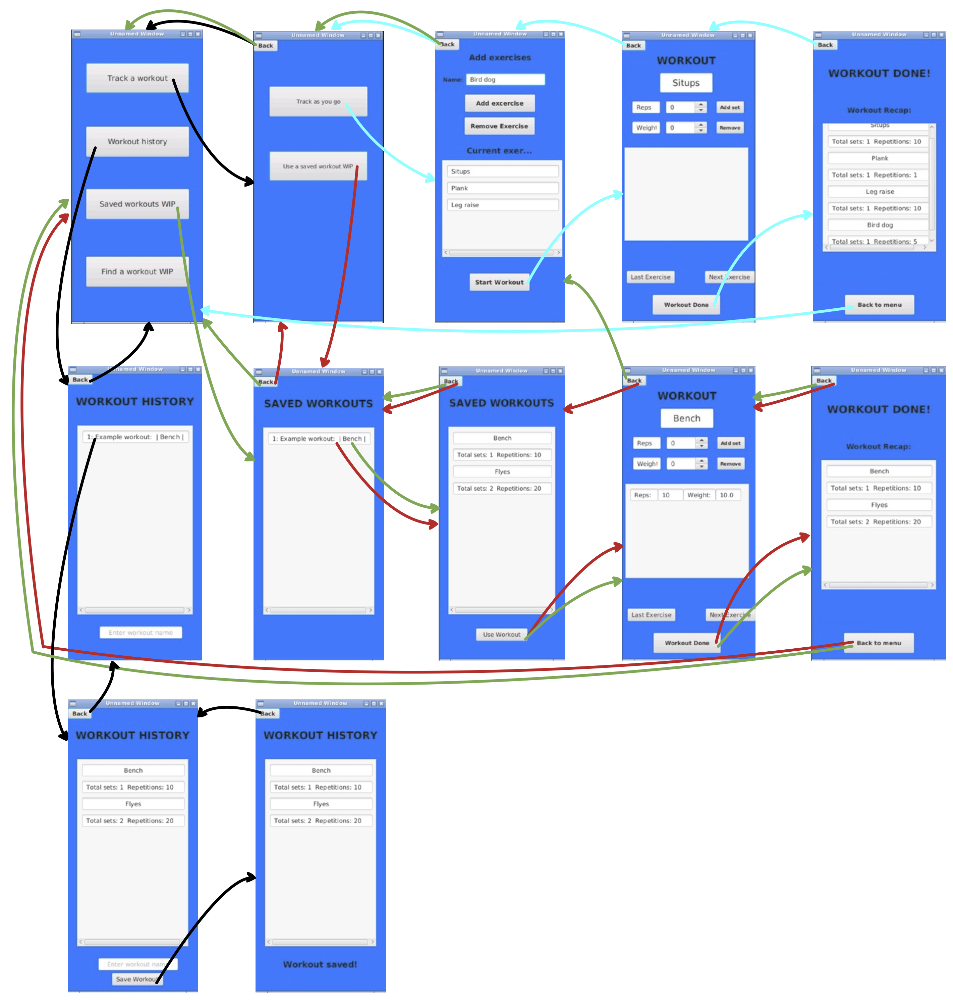

# Treningsapp

## Organisering av appens kode

Prosjektet inneholder en enkel trelagsapplikasjon. 
Den er modularisert og inneholder to moduler. 

Den første modulen [**core**](treningsapp/core/src) inneholder Domenelaget og Persistentlaget. 
Den andre modulen [**fxui**](treningsapp/fxui/src) inneholder Brukergrensesnittlaget.

## Bruk av appen

Treningsappen vi har laget er ment til å hjelpe deg med å sette opp treningsøkter og guide deg gjennom dem. I tillegg til dette kan du sjekke treningshistorikken som viser hvilke økter du har gjennomført, og har mulighet til å lagre øktene hvis du vil bruke dem om igjen. Illustrasjonen viser hvordan knappene og skjermene henger sammen.

Den øverste knappen på menyen, «Track a workout», tar deg videre til en ny skjerm hvor du enten kan velge å lage økten der og da, eller bruke en lagret økt. Velger man «Track as you go» kommer man til en skjerm som lar deg legge til øvelser du skal bruke i økten. Når du har lagt til øvelsene du ønsker, kommer du videre til selve trackingen av økten. Her legger man inn repetisjoner og sett, og kan bla mellom øvelsene. Vil du bruke en lagret økt, velger man knappen «Use a saved workout WIP» og så åpnes en skjerm med dine lagrede treningsøkter. Hvis man trykker på en økt, får man se hvilke øvelser, hvor mange sett og repetisjoner, og kan starte økten. Under gjennomføringen av økten vil settene allerede ligge inne i økten, men man kan både legge til og fjerne sett underveis.

Knapp nummer to på menyen tar deg til treningshistorikken. Her havner alle gjennomførte økter, og dersom man trykker på en av dem, åpnes en ny skjerm som viser detaljene i økten. Herfra kan man velge å lagre den, eller bare gå tilbake til historikk. For å finne de lagrede øktene trykker man på knapp nummer tre på menyen. Her kan man også starte en økt ved å trykke på den og deretter velge «Use Workout».

